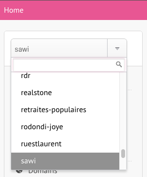

# Alwaysdata

[admin.alwaysdata.com](https://admin.alwaysdata.com/)   
login: `user@antistatique.net`

## Create client
If your customer isn't registered, you have to create it

- [admin.alwaysdata.com/admin/account](https://admin.alwaysdata.com/admin/account/)
- Use the __Add acount__ action
- Fill in the form with your informations and the __Pack 10GO__
  - Go to __1Password__ and duplicate the `Alwaysdata - Template` entry. Then edit it and insert your project informations.
    - Naming: Alwaydata - `[customer_name]` - `[project_name]`
    - Generate a strong password for the alwaysdata account
    - Check that the antistatique __Vault__ is selected when saving the entry
  - Select __yearly__ payment
  - Select __Antistatique Paris(France)__ server

## Create vhost

- Select your newly created account in the left dropdown



- __add a site__
  - Use following naming convention: `[customer_name]` - `[environment]` (Eg: `Cardis - Staging`)
  - If the customer DNS already point on Alwaysdata, you can use a domain like `env.domain.ltd`
  - Otherwise you have access to Antistatique following subdomains: __production__, __staging__, __test__ (Eg: `cardis.staging.antistatique.net`)
  - Configuration type: `Apache standard`
  - Root directory:
    - For this, you must set the final serving folder of the website `/www/env.domain.ltd/`
      - Add `/current/` for capistrano
      - Add `/web/` for drupal
      - ... and take other cms/tools in account
  - Force HTTPS but __do not forget__ to verify the Let's Encrypt certificate

## Create Let's Encrypt certicicate

- [admin.alwaysdata.com/ssl](https://admin.alwaysdata.com/ssl/)
- __add a SSL certificate__
- Select `Create a Let's Encrypt certificate`
- Add the domain you want to add SSL (the domain must already point on the server)
- After saving, the certificate is listed as "incomplete". This is normal, let it like this, it will be validated in some time automatically

## Create database & user

- [admin.alwaysdata.com/database](https://admin.alwaysdata.com/database/?type=mysql)
- __add database__
  - Name your database
- __User management -> Add user__
- Create the user, generate passsword and insert add it into __1Password__
- Enable `SSL connection required` (it could break some CMS such Wordpress)
- For security reason, a user must only access to his database

## Setup PHP
- [admin.alwaysdata.com/environment/php](https://admin.alwaysdata.com/environment/php/)
- Choose a php version corresponding to your needs

## Setup SSH
- [admin.alwaysdata.com/ssh](https://admin.alwaysdata.com/ssh/)
- Generate password and save data into __1Password__
- Tick `enabled`

## Connect with SSH
- Add the new host to your ssh config file `vi ~/.ssh/config`

  ```
  host cardis
  hostname antistatique.alwaysdata.net
  user cardis
  ForwardAgent yes
  IdentityFile ~/.ssh/id_rsa
  ```

- Push your key on the server using `ssh-copy-id` (Eg: `ssh-copy-id cardis`)
- Login with the SSH user
- Congratulations, you are connected !

## Troubleshooting

### the CLI always ask me my passphrase SSH

Add your passphrase to your Keychain using `ssh-add -K ~/.ssh/id_rsa`
