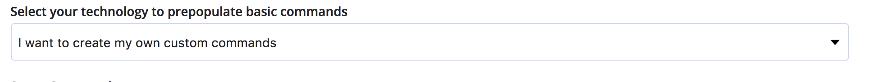
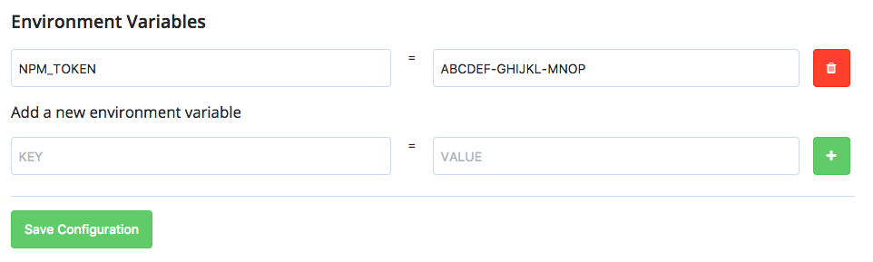
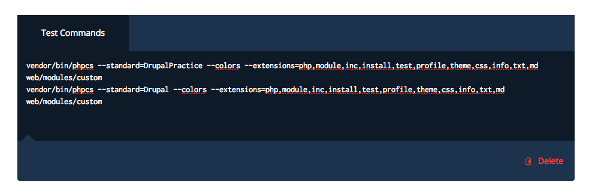
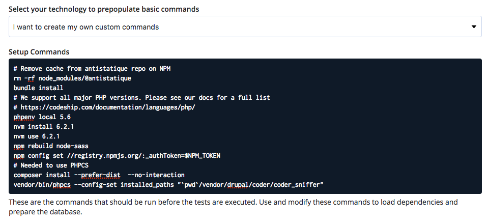
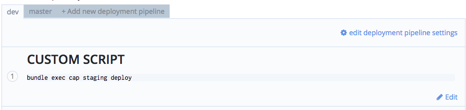
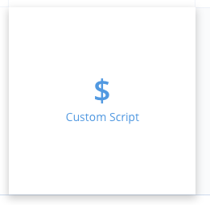

# Continuous Integration & Continuous Deployment

The deployment of branch `dev` and `master` is automatically managed by Codeship and Capistrano !

## Capistrano

@TODO

## Codeship

[codeship.com](https://app.codeship.com/antistatique)

### Create

https://app.codeship.com/projects/204851/project_setup_steps/select_scm

### Settings

1. Into the first tab nammed *Test*, you will prepopulate some basic commands to initalize every deployments.

2. Select your technology to prepopulate basic commands: **I want to create my own custom commands**



3. Fill the Setup Commands

  - Install `Bundle` to run our Capistrano tasks
  ```
  $ bundle install
  ```

  - *(Optional)* Fix PHP version
  ```
  $ phpenv local 5.6
  ```

  - Install and fix Node version
  ```
  $ nvm install 6.2.1
  $ nvm use 6.2.1
  ```

  - Rebuild node-sass
  ```
  $ npm rebuild node-sass
  ```

  - *(Optional)* Authentication for NPM
  You should create a *Codeship Environment Variables* into the tab *Environment* and use it with `$`.

  

  ```
  $ npm config set //registry.npmjs.org/:_authToken=$NPM_TOKEN
  ```

  - *(Optional)* Clean an NPM dependencies
  ```
  # Remove cache from antistatique repo on NPM
  $ rm -rf node_modules/@antistatique
  ```

  


4. Configure Test Pipelines

  - *(Optional)*  Run PHPCS for Drupal
    ```
    # Needed to use PHPCS
    $ composer install --prefer-dist  --no-interaction
    vendor/bin/phpcs --config-set installed_paths "`pwd`/vendor/drupal/coder/coder_sniffer"

    $ vendor/bin/phpcs --standard=DrupalPractice --colors --extensions=php,module,inc,install,test,profile,theme,css,info,txt,md web/modules/custom
    $ vendor/bin/phpcs --standard=Drupal --colors --extensions=php,module,inc,install,test,profile,theme,css,info,txt,md web/modules/custom
    ```

    

### Deployment

1. Into the first tab nammed *Deployment*, you will create deployment pipelines per branch that will be executed after your tests passed.

2. Create a new pipeline with **+ Add new deployment pipeline**



2. Select the `Custom Script` deployment method & add your capistrano deployment command `$ bundle exec cap staging deploy`


